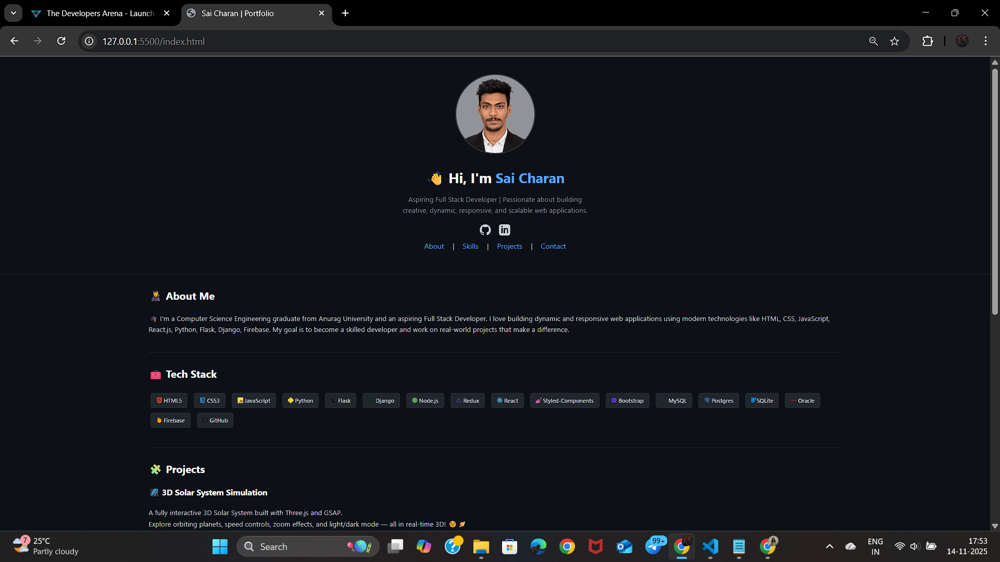

<h1 align="center">🌐 Personal Portfolio (Week 2 Project)</h1>

<p align="center"> 
  
  
</p>

<p align="center"> A modern and visually enhanced <b>Portfolio Website</b> created as part of my <b>Week 2 Internship Project</b>. This version includes an upgraded UI with improved layout, animations, responsive design, and a professional look inspired by GitHub profile themes. </p>

---

## 🎯 Features

- 🎨 Modern UI with clean layout
- 📱 Fully responsive design (Mobile + Tablet + Desktop)
- 🧩 Projects section with hover effects
- 📝 Contact form redesigned with better UI
- 🎭 Smooth hover animations & glowing effects
- 🖼 Beautiful profile photo container (GitHub style)
- 📌 Structured sections for About, Skills, Projects & Contact  

---

## 🛠️ Technologies Used

- **HTML5**
- **CSS3**
- **System Font Stack**
*(Windows → Segoe UI, macOS → San Francisco, Android → Roboto))*
- **Responsive Design Techniques**

---

## 📸 Preview

  
  
---

## 🚀 How to View

To view the project locally:  
```bash
open index.html
```
---

## 👨‍💻 Author

It’s me — **Sai Charan Janagama** 😄<br>
🎓 Computer Science Graduate | 🌐 Aspiring Full Stack Developer<br>
📧 [Email Me](saic89738@gmail.com) ↗<br>
🔗 [LinkedIn](https://www.linkedin.com/in/saicharanjanagama/) ↗<br>
💻 [GitHub](https://github.com/SaiCharanJanagama) ↗

---

## 💬 Feedback

If you have any feedback or suggestions, feel free to reach out!  
Your input helps me improve 🚀
